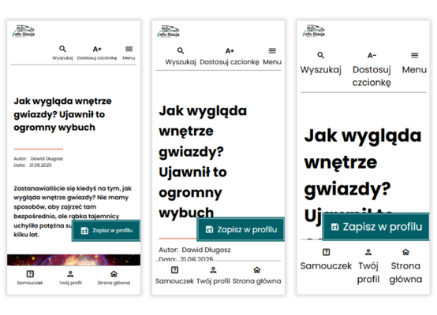

# Web application – information service with a special focus on the needs and barriers of older adults

This application was developed as part of my Master’s thesis project. It was designed in accordance with WCAG guidelines, with a primary focus on older adults, who were the subject of my research.

I am continuously expanding my programming knowledge and see opportunities to further improve this project. Therefore, I am currently refactoring the codebase to enhance its quality and maintainability.

Feel free to follow the repository to stay updated with upcoming improvements and changes!

## Application Structure

The service consists of:

- **Home page** – with content carousel displaying the five latest world news articles.

- **Article search subpage** – including both voice and text search options, search results and other articles sections.

- **User profile subpage** – containing registration and login views, logged-in dashboard where users can see their personal information and a section displaying their saved articles.

- **Article details subpage** – presenting the full content of the selected article with a link to the original source, and the option to save the article.

## Main Features

  <ul>
    <li>
      
Font adjustment feature

      
    </li>
  </ul>

## Technolgies

